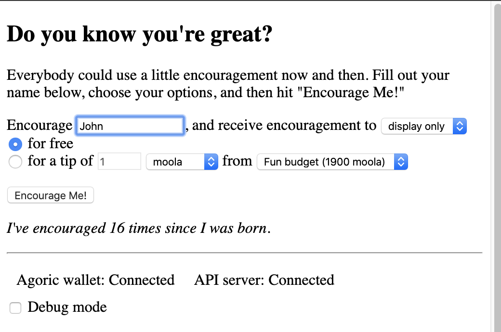
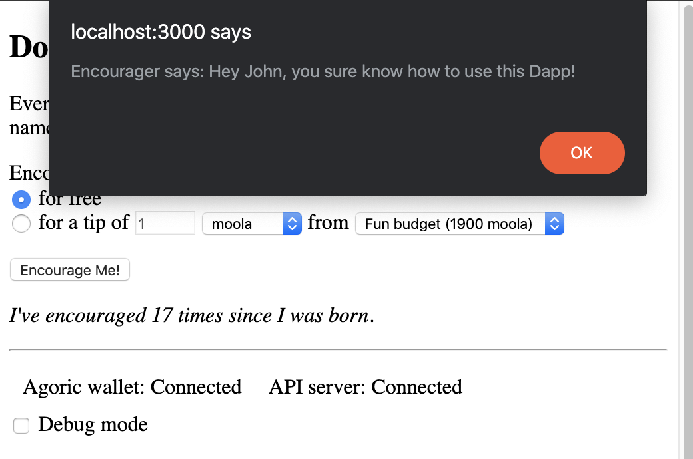

# Encouragement Dapp

TL;DR:
```sh
# Start the Agoric platform
agoric install && agoric start --reset
# In another terminal, deploy this contract
agoric deploy contract/deploy.js
# Start the API server
agoric deploy api/deploy.js
```
Then navigate to http://localhost:5003.

The Encouragement Dapp is the simplest [Agoric
Dapp](https://agoric.com/documentation/dapps/). It
demonstrates the three important parts of
a dapp and how they should be connected:
1. the browser UI (the frontend)
2. the API server (the backend)
3. the on-chain contract

This dapp starts a local
blockchain on your computer, and deploys a basic contract to that
blockchain. It does not currently deploy or connect to the Agoric testnet.

This particular dapp UI is written in vanilla JS for simplicity (as
opposed to using a framework).

The dapp API is written with Express, to illustrate how you
can use ordinary Node.js modules with an ocap interface to the chain.

## Functionality

The Encouragement Dapp:

1. Subscribes to contract notifications via the API server
2. Accesses your Agoric wallet, and
3. At the user's request, either:

    1. requests some free encouragement, or
    2. proposes (via the user's wallet and Zoe) exchanging a Tip for
       some Encouragement (the tip is not yet sent to the Zoe
       contract, but you will still get some encouragement.)

To learn more about how to build Agoric Dapps, please see the [Dapp Guide](https://agoric.com/documentation/dapps/).

Here's the interface:



and after we click the "Encourage Me!" button:



See the [Dapp Deployment Guide](https://github.com/Agoric/agoric-sdk/wiki/Dapp-Deployment-Guide) for how to deploy this Dapp on a public website, such as https://encouragement.testnet.agoric.com/

## TODO

Things we need to fix are listed in [the Github issues for this repository](https://github.com/Agoric/dapp-encouragement/issues).
